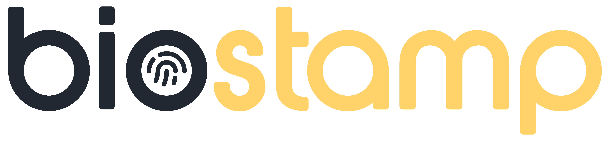

<!-- top section -->

	

**Help us gain some traction and hit that ⭐ button!**

### Rid your users from passwords and regain lost trust

### Biostamp is a self-hosted, open-source solution that provides easy-to-use advanced biometric authentication. Join us towards a **#passwordless** future.

